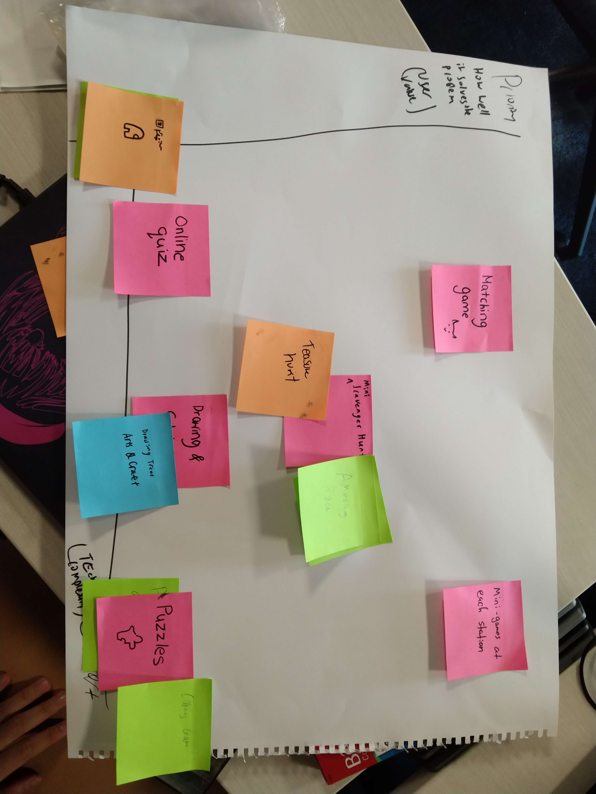

Class:
The day began with a lecture on the Feedback Mindset, a crucial aspect in our ongoing project. We also submitted our Github usernames for seamless collaboration on the project platform.

Project:
Unfortunately, our clients had to reschedule our meeting to next Tuesday, 25th July. We're currently considering the possibility of having a Zoom meeting in the evenings this week.

We also had a joint meeting with Team 1A. Our objective was to plan a distinct and enriching experience related to our problem statement, making sure there's no overlap between the tasks of the two teams. We're focusing on collaboration over competition. It was decided that Team A will handle the learning experience before and after the fossil grove visit, while Team B, our team, will take charge of the learning experience during the visit.

Our internal meeting allowed us to brainstorm innovative ideas to make the fossil grove visit engaging, even considering gamification of the experience. We narrowed down the ideas to an Amazing Race or Treasure Hunt style activity, likely a fusion of the two. We brainstormed steps on how to implement this idea and assigned roles and responsibilities for implementation.

We also updated our clients via email about our collaboration idea.

Tentative Roles & Responsibilities:

| Member    | Role                    |
| --------- | ----------------------- |
| Dylan     | Backend & Product Owner |
| Keng Li   | Frontend                |
| Priscilla | Frontend                |
| XiangHui  | Gamemaster              |
| Yee Kit   | Gamemaster              |
| Derick    | Gamemaster              |

Brainstorming Session Output:

We have attached images reflecting our user value graph for the ideas, the pros and cons of our narrowed down idea, and a preliminary plan for Team 1A & B collaboration, which we have also shared with our client.

## User Value Graph

This graph illustrates the perceived user value of our proposed ideas.

## Pros & Cons of Our Idea

This image displays a detailed analysis of the pros and cons of our narrowed-down idea.

## Preliminary Plan for Collaboration

This is our preliminary plan for the collaboration between Team 1A and Team 1B.

