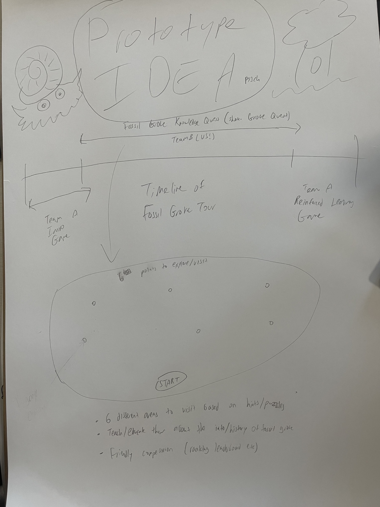

Today, we held an internal meeting to discuss and plan for our upcoming client meeting at Fossil Grove. Preparations included gathering essential questions to ask our clients and deciding on the visuals and prototypes we want to present.

We have prepared a general project idea flow/plan visual sketch that we intend to show our clients tomorrow. It's a crucial part of our presentation as it gives a comprehensive overview of our project plans.

