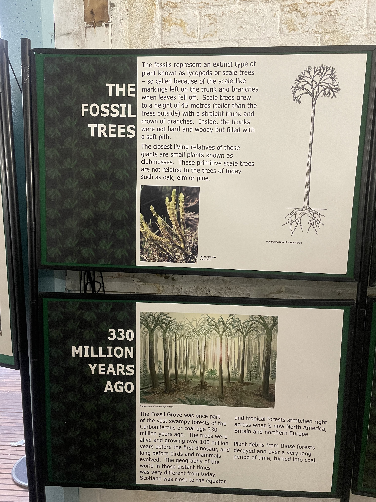

Today was an exciting day! We finally met with David from Fossil Grove and Boyd from Scotstoun Primary. It was a highly productive session, and we gleaned many insights from our interactions.

### Project

We embarked on a guided tour at Fossil Grove, visiting mainly three locations: the main museum, the back of the museum, and the quarry.

During the tour, we learned many details that significantly influence our project. We were informed that the field trips usually involve a group of 30 students divided into smaller groups of 6-7, each supervised by a teacher. Each student has their own iPad device, which opens up many possibilities for our project.

We identified four main areas of focus (stations): the main museum, back of museum, front area, and quarry. To ensure a fair and engaging experience, it was suggested that we refrain from using a leaderboard or points system and instead reward students based on completion of tasks.

We learned that the educational focus includes geography, history, and biology, providing a rich blend of learning opportunities for the students.

Constraints identified include the lack of WiFi connection at the venue and the need to cater to students with additional support needs. The tours are self-guided, meaning the students will explore independently.

We presented our current idea to the clients, who received it very positively. They offered suggestions on integrating their existing physical activities with our new digital activities.

Our clients requested our decision on several aspects such as the time to be spent at each station, the challenges for each station, and ways to enhance engagement for the students.

Moving forward, our team plans to continue iterating our paper prototypes for the challenges based on what we learned today.

Images we have taken onsite:

