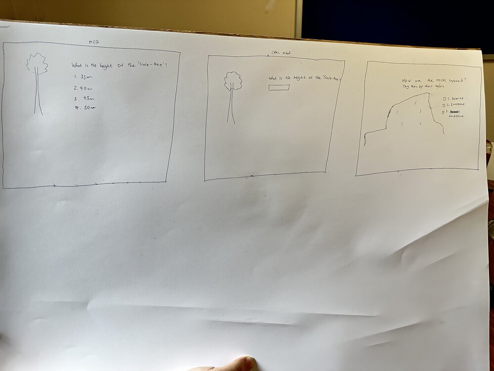
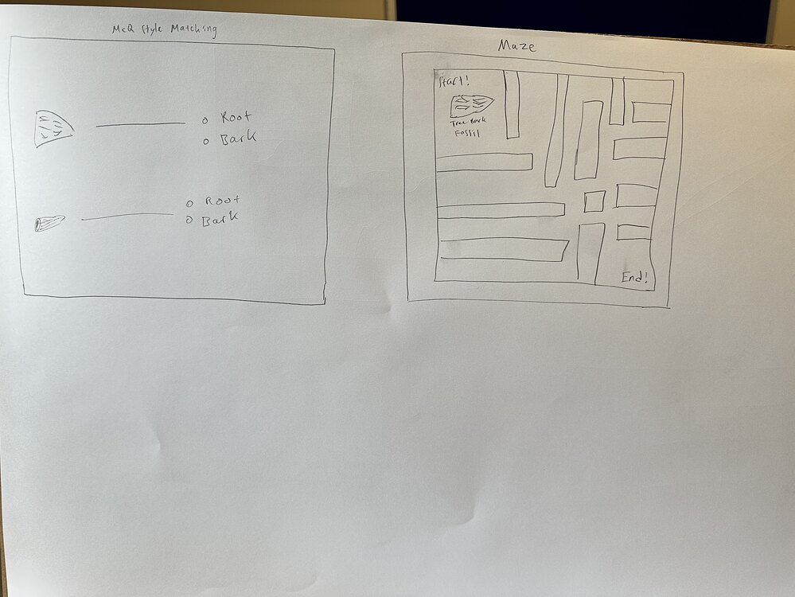

Project:
Today was a day of iteration and refinement. Based on the valuable feedback from our clients and the insights we gleaned from our visit to Fossil Grove, we discussed and proceeded to draw another iteration of our paper prototype. We simplified the tasks at each station and opted for simpler puzzles, such as jigsaw or sliding puzzles, instead of word matches.

From our paper prototype, we identified the better designs and proceeded to create a high-fidelity prototype using Figma. We also worked on crafting better and simpler questions that are not overly information-heavy and can be easily answered by the students using the resources available at Fossil Grove.

We have emailed our clients in conjunction with Team A, updating them about our current progress on the puzzles and trivia questions. Moving forward, we plan to finalize the designs on Figma and request feedback from the client.

Documentation Site:
Our front-end team began work on creating a static website to showcase our project's journey and accomplishments. We chose Docusaurus as our platform due to its robust documentation capabilities and integrated blog feature. As a fun coincidence, Docusaurus' dinosaur-themed logo aligns with the theme of our project, despite Fossil Grove predating the dinosaur era.

Inspired by our trip to Fossil Grove, we opted for a lush green color scheme for the website. This color choice mirrors the verdant scenery of Fossil Grove and sets a vibrant and welcoming tone for our future website visitors.

Our goal is to make our website both accessible for quick browsing and comprehensive for those seeking in-depth understanding. The site will feature a reflection page detailing our project journey and a "proud" page where we highlight why we take pride in our work.

Looking ahead, we plan to refine our website's UI/UX, work on the ideation and proud pages, and incorporate project-related multimedia content to enhance website engagement. Our hope is to create a visually appealing website that truly encapsulates the progress of our project!

Puzzles:

Static Site:

