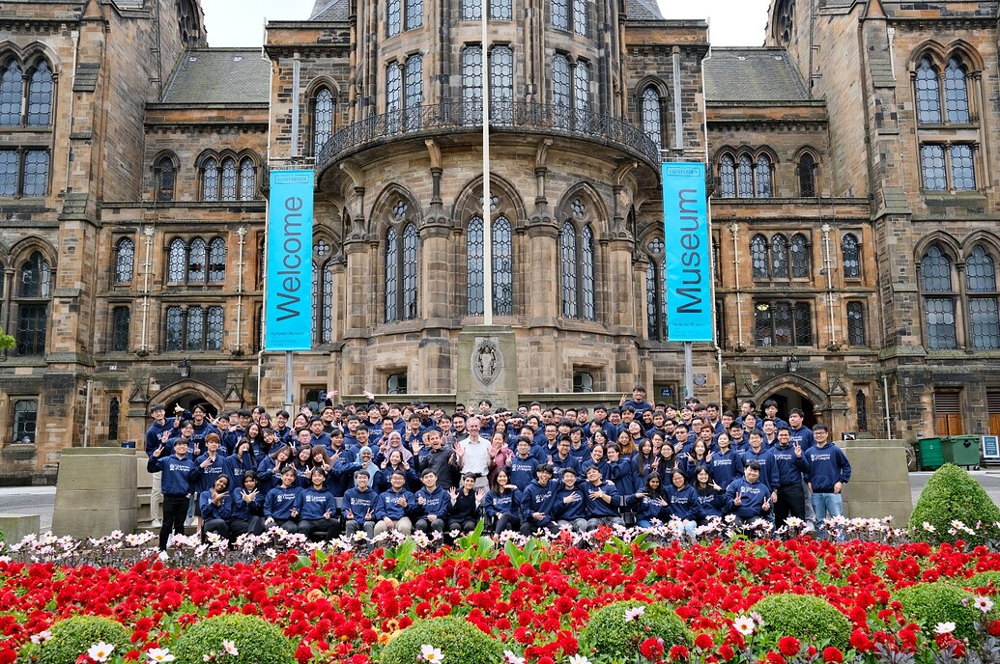
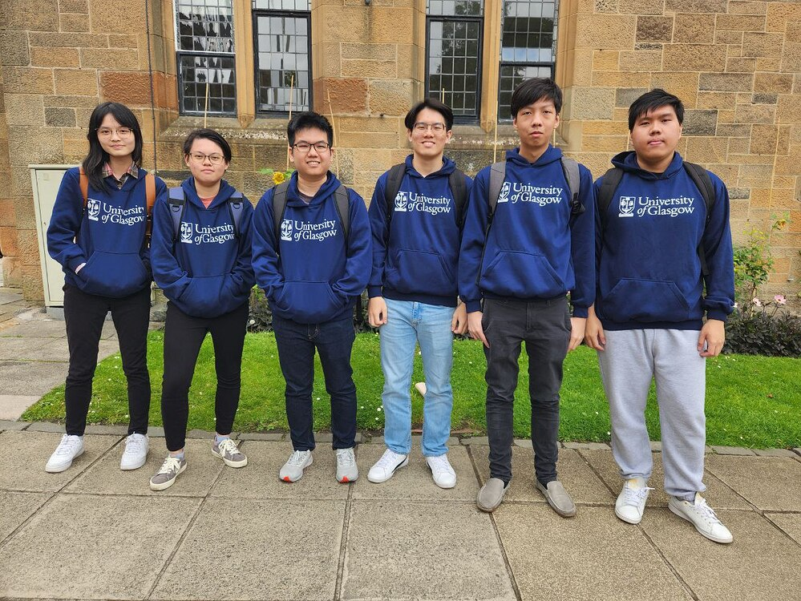

### Class

Today's class was focused on usability testing. We engaged in a hands-on activity where we folded paper airplanes and then wrote instructions for others to replicate the process. This activity highlighted the notion that what seems straightforward in our minds may not be as easy to understand from a different individual's point of view.

### Project

We've accomplished several milestones today:

1. We submitted our week 2 pitch video:
   [Team 1B Week 2 Pitch Video](https://www.youtube.com/watch?v=WGzO_sA88Ik&ab_channel=YeeKitGoh)

2. We've updated our Grove Quest high-fidelity prototype on Figma:
   [Figma Prototype](https://www.figma.com/file/cpZj0jrg4ur1OmgpHpMLsD/Grove-Quest-App-UI?type=design&node-id=1048-2807&mode=design)

3. Our portfolio static website has been deployed, although it's still under development.

In addition to these accomplishments, we also had a little bit of fun today and took a cohort and group photo!

