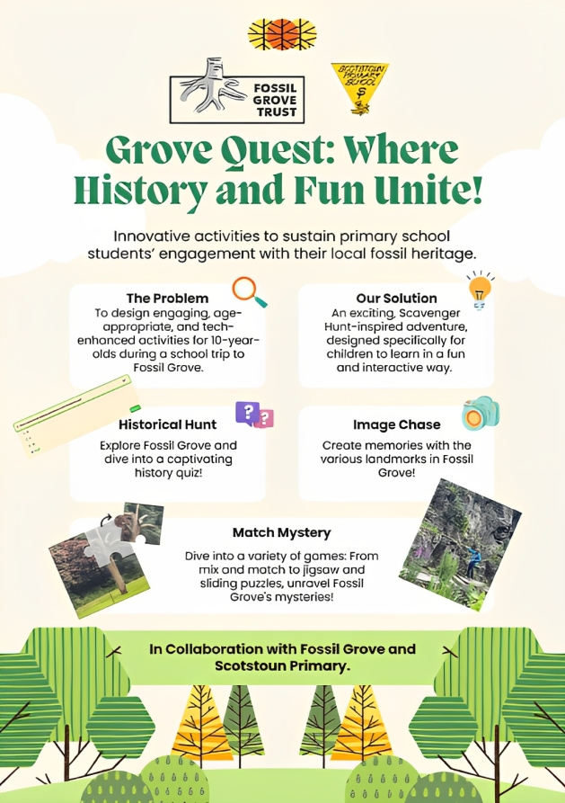

Project:
Today, our team focused on incorporating the feedback we received from David of Fossil Grove and Mr. Boyd from Scotstoun Primary, which was delivered through email correspondences over the weekend. This feedback allowed us to further iterate and improve upon our trivia questions and puzzle games, which are displayed in our high-fidelity prototype.

In addition, we created animated demos on Figma to visually present the flow of our idealized version of the Grove Quest project.

A significant portion of our efforts was channeled into crafting the initial draft of our Project Poster, adhering to the guidelines given by Prof Grizou. Here's a snippet of our first draft:

We plan to continue refining our poster tomorrow and aim to have it ready for submission by Wednesday.
