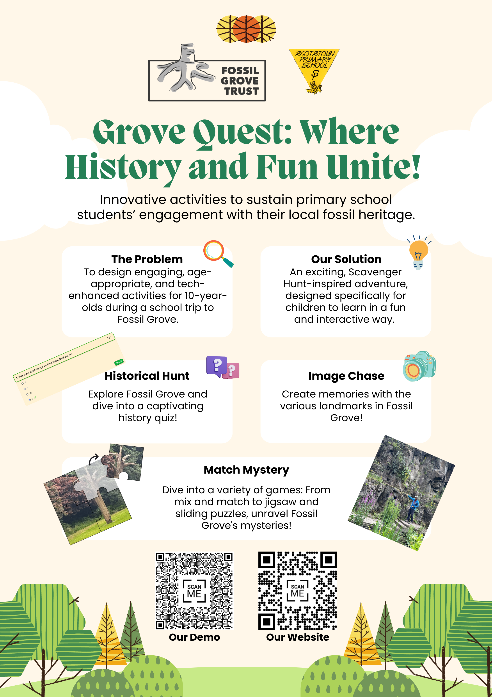

Today, we managed to finalize and complete our poster! We decided to add two QR codes to allow visitors to check out our demo and portfolio website when they visit our exhibition booth.

We consulted Prof Grizou on two matters today: Usability Testing and repo/production URL.

For the production URL, we renamed it to something more informative and user-friendly. Our new production URL is now [https://grove-quest.vercel.app/](https://grove-quest.vercel.app/), where Grove Quest is the name of our solution game! As for the repository name, we will rename it at a later time when everything is finalized.

We performed usability testing with members from other groups who did not fully know what our project is about. This is important to get a clean and unbiased opinion for user experience and usability. We let them use our Figma prototype puzzle game demos on their own, and asked them for feedback, which we recorded on a Google form. Here is one of the result graphs just for an example.

The other results and our reflection and analysis of them will be included in our website subsequently.

Tomorrow, we will be focusing on our static site content, which will document the culmination of our efforts thus far (also to prepare for Thursday’s exhibition).
