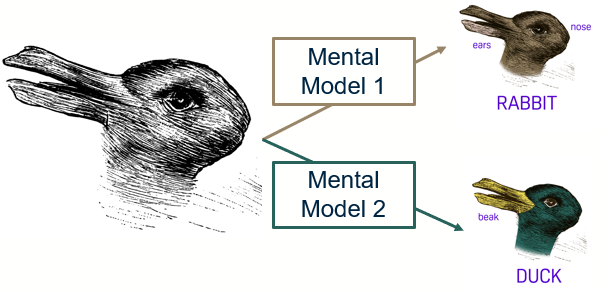

# Aligning Mental Models

export const Highlight = ({children, color}) => (

{children}

);

Mental models are representations that individuals have in their minds about how things work in the world. They shape interactions with different systems, including digital products like ours. Aligning our product design with users' mental models is crucial to ensure an intuitive and satisfying user experience.

## User Mental Model

Through our initial requirements gathering, we've developed an understanding of our users’ mental models of the project.

The primary users, students at Scotstoun Primary and staff at Fossil Grove, have certain expectations and understandings about the planned activities and how they should work.

For instance, students anticipate <Highlight color="#11a281">engaging activities</Highlight> that are easy to digest, and the staff hope for a solution that communicates the <Highlight color="#11a281">geological significance</Highlight> of Fossil Grove effectively.

## Designer Mental Model

Our design team approached this project with the intent to create a learning solution that is engaging, educational, and interactive. We aim to create an experience that highlights the geological importance of Fossil Grove and captures students' interest while providing teachers with manageable resources for instruction.

## Identifying Gaps

During the initial stages of design, a few gaps were identified between the user and designer mental models. For instance, there were disparities in the perceived complexity of the activities - what seemed simple for the designers might be difficult for students in the intended age group. There was also the challenge of how to effectively communicate geological concepts to young students.

## Alignment Strategies

To address these gaps, we employed a few strategies:

- **User Research**: We gathered data about our users' needs, abilities, and expectations. This helped us to understand their mental models better.
- **Iterative Design**: We adopted an iterative design process, constantly refining our solution based on user feedback and testing.
- **Close Collaboration**: We worked closely with teachers at Scotstoun Primary and staff at Fossil Grove to ensure that the solution meets their needs and expectations.

## Evaluating Success

We measure the success of our alignment efforts through user testing and feedback. The level of ease with which users can navigate and use our solution is a strong indicator of how well the product aligns with their mental models. Feedback from teachers and staff about the effectiveness of the educational activities is also a crucial measure of success.
