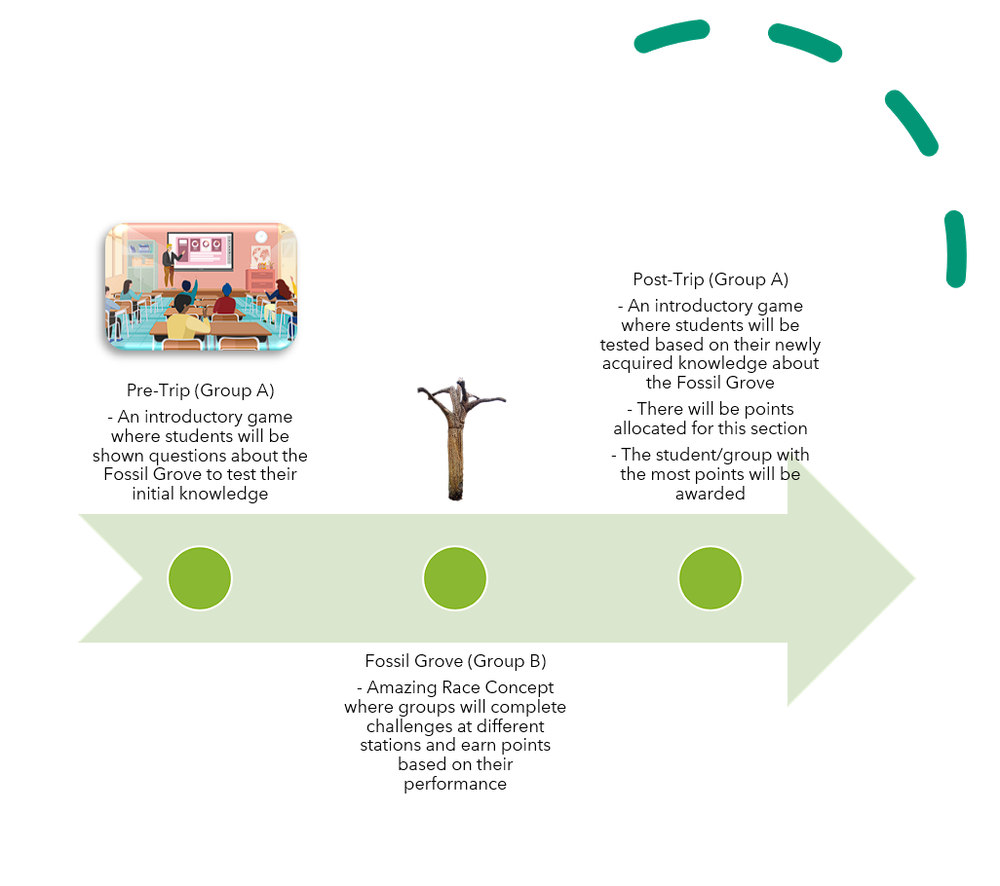
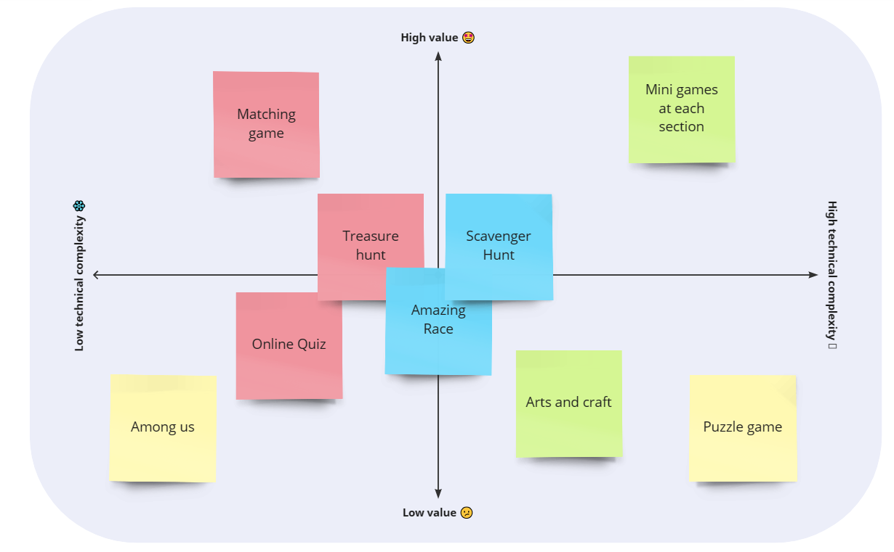
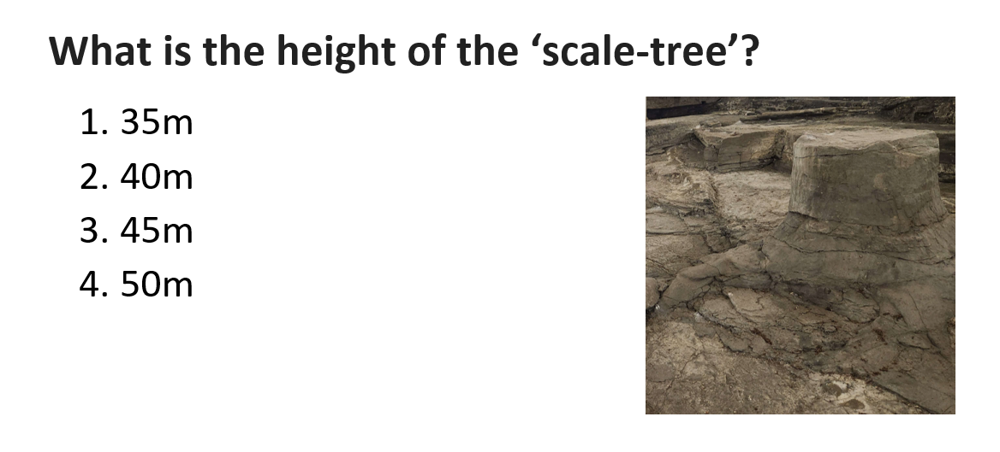
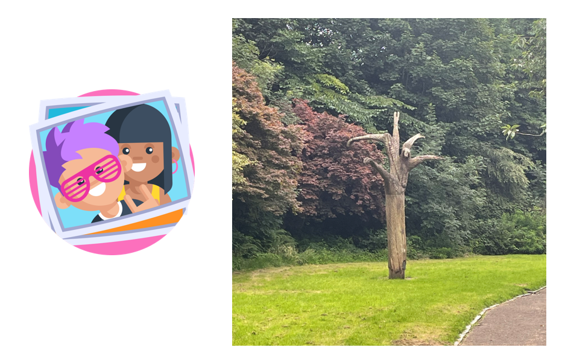
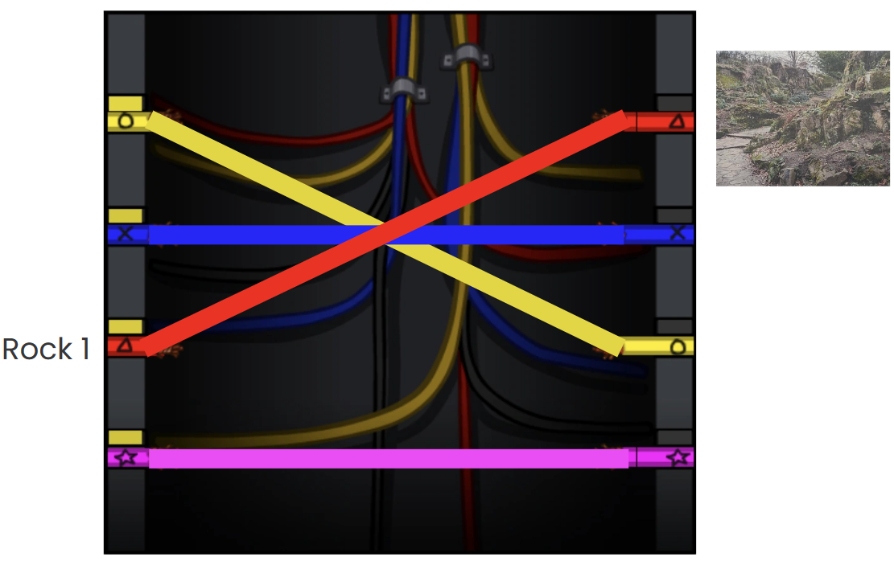

# Iterating

export const Highlight = ({children, color}) => (

{children}

);

## Initial Ideas

The two teams working on the Fossil Grove and Scotstoun Primary met and agreed that we should <Highlight color="#11a281">collaborate instead of compete</Highlight> with each other. As such, there will only be one point of contact for the clients. This <Highlight color="#11a281">alleviates potential confusion</Highlight> for our clients as they would no longer have to juggle communication with separate teams for each project.

The initial idea was:

- A platformer game with augmented reality elements for interactivity
- A microsite to advertise the various points of interest in Fossil Grove and the game

## Splitting the teams

After further requirement gathering, the teams decided that a <Highlight color="#11a281">comprehensive learning journey</Highlight> was a better fit to the clients needs. This learning journey ensures that the students are well equipped with knowledge to explore Fossil Grove and to ensure that the students left with an enriched knowledge of Fossil Grove.

Our team would be focusing on the experience of the students while they are at Fossil Grove and team A would be concentrating their efforts on improving the students experiences before and after the trip.

## Ideation of the during trip experience

Our team brainstormed using the value vs. complexity framework. We generated potential solutions to the problem and placed them appropriately on the graph, based on our assessment. The aim of the framework is to identify ideas that were of high value to the clients but also of a lower technical complexity, <Highlight color="#11a281">ensuring the feasibility</Highlight> of the project concepts. As shown in the image above, the ideas that struck the optimal balance between value and technical simplicity were the scavenger hunt, treasure hunt, and the amazing race.

Due to the similarity of these ideas, we decided to concentrate on the scavenger hunt theme. This choice was made to make certain that our clients had a clear understanding of the idea. The students would have to tackle a series of mini-games at the different points of interest at Fossil Grove. These challenges aim to:

- Keep the students <Highlight color="#11a281">engaged and eager</Highlight> to learn more
- Provide students the <Highlight color="#11a281">freedom to explore</Highlight> fossil grove while <Highlight color="#11a281">gaining knowledge</Highlight>
- Give the students a <Highlight color="#11a281">sense of accomplishment</Highlight>

## Expanding on Grove Quest

The team agreed upon on 3 types of mini-games for the students. These mini-games were chosen because:

- They are easy to understand
- They can be carried out in small groups
- They encourage discovery and exploration

### Mini-game 1: Historical Hunt

The image above shows an example of a historical hunt mini-game. Students will be shown a question and will need to explore independently and locate the answer within the station's vicinity. This encourages students to deepen their understanding of Fossil Grove's history and foster their interest in geology or history.

### Mini-game 2: Image Chase

In this mini-game, students will have to take photos with their group members at the landmarks and upload them. This activity not only allows students to forge lasting memories of their time at Fossil Grove but also strengthens bonds with their peers.

### Mini-game 3: Match Mystery

In Match Mystery, students will be presented with a set of images and their corresponding labels. They will need to pair each image to their label. It promotes interactive learning and enhances critical thinking as students are required to closely scrutinize each image before deciding on its match.
