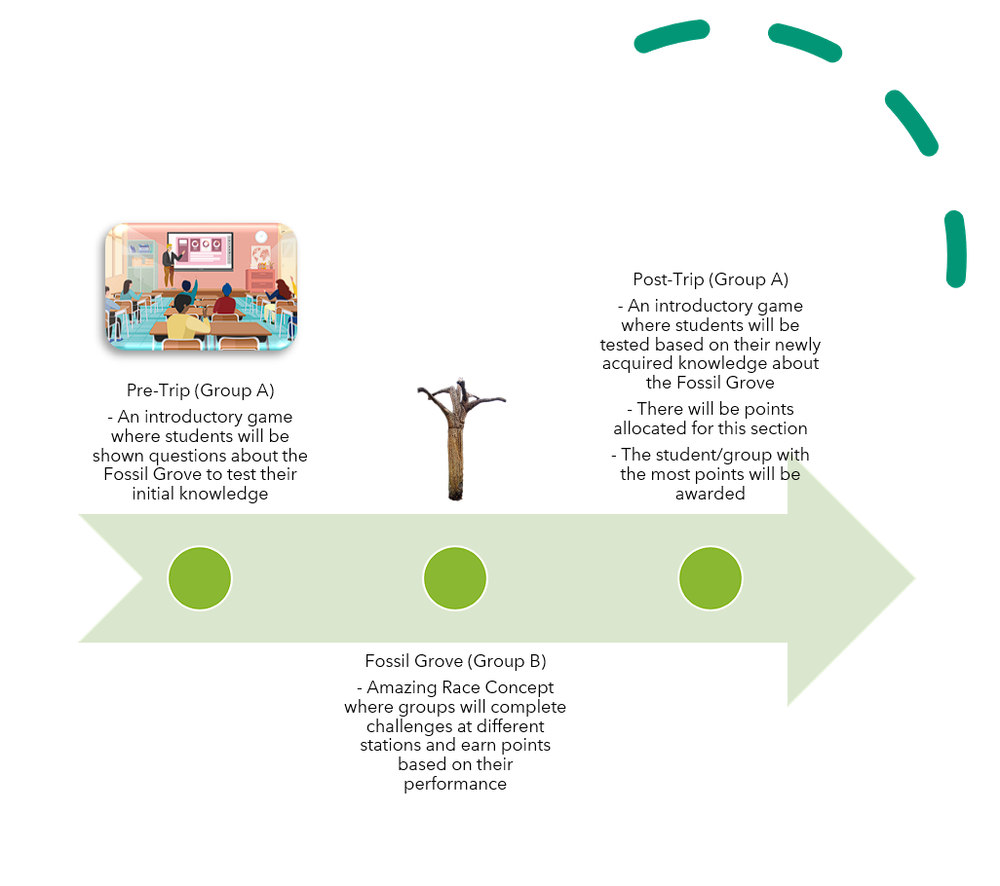

# Iterating

export const Highlight = ({children, color}) => (

{children}

);

## Initial Ideas

The two teams working on the Fossil Grove and Scotstoun Primary met and agreed that we should <Highlight color="#11a281">collaborate instead of compete</Highlight> with each other. As such, there will only be one point of contact for the clients. This <Highlight color="#11a281">alleviates potential confusion</Highlight> for our clients as they would no longer have to juggle communication with separate teams for each project.

The initial idea was:

- A platformer game with augmented reality elements for interactivity
- A microsite to advertise the various points of interest in Fossil Grove and the game

## Splitting the teams

After further requirement gathering, the teams decided that a <Highlight color="#11a281">comprehensive learning journey</Highlight> was a better fit to the clients needs. This learning journey ensures that the students are well equipped with knowledge to explore Fossil Grove and to ensure that the students left with an enriched knowledge of Fossil Grove.

Our team would be focusing on the experience of the students while they are at Fossil Grove and team A would be concentrating their efforts on improving the students experiences before and after the trip.

## Ideation of the during trip experience

Our team brainstormed using the value vs. complexity framework. We generated potential solutions to the problem and placed them appropriately on the graph, based on our assessment. The aim of the framework is to identify ideas that were of high value to the clients but also of a lower technical complexity, <Highlight color="#11a281">ensuring the feasibility</Highlight> of the project concepts. As shown in the image above, the ideas that struck the optimal balance between value and technical simplicity were the scavenger hunt, treasure hunt, and the amazing race.