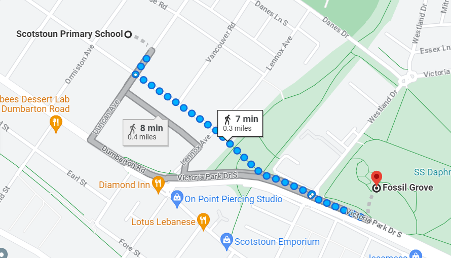

# Prototyping

export const Highlight = ({children, color}) => (

{children}

);

Our proposal for Grove Quest has received approval from our clients. They offered us some guidance for further development:

- Ensure that all mini-games are  <Highlight color="#11a281">simple enough for students</Highlight> to complete.
- Consider the needs of <Highlight color="#11a281">students with physical/mental disabilities</Highlight>.
- Have more variety in Match Mystery, moving beyond matching the image and the labels.

## Development of the mini-games

During the fruitful trip to Fossil Grove, the team identified 4 key areas to function as the stations for Grove Quest:
1. Statue of the tree
2. Inside the Fossil House
3. Path leading to the Fossil
4. The Quarry area

The trip also played a crucial role in assisting our team to create more targeted content for the mini-games.

## Paper prototypes

Paper prototypes were created to emulate the game experience during the trip. These paper prototypes serves two purposes:
- To generate new variations of Match Mystery
- To enable <Highlight color="#11a281">swift prototyping</Highlight> by the team, to create a inclusive design for the students

## Feedback

We submitted the paper prototypes, along with the mini-game questions and activities, to our clients for their review. They provided the following feedback:

- The games should be tailored to be more appealing and appropriate for children.
- Accommodations should be made to <Highlight color="#11a281">support students with disabilities</Highlight> e.g. dyslexic students.
- <Highlight color="#11a281">More visual aids/cues</Highlight> could be used to help the student navigate easily.
- The games should foster learning in a manner that discourages guessing.

## Figma

Considering the feedback received, we refined our designs and created a high-fidelity prototype incorporating the following adjustments:

- The mini-games have been designed to be solvable by primary school students of varying abilities
- The <Highlight color="#11a281">layout of the mini-games has been improved</Highlight> to present the content more effectively
- The <Highlight color="#11a281">complexity of the language</Highlight> used has been <Highlight color="#11a281">reduced</Highlight> to enhance understandability.
- <Highlight color="#11a281">More visuals and cues</Highlight> were added to guide gameplay.

