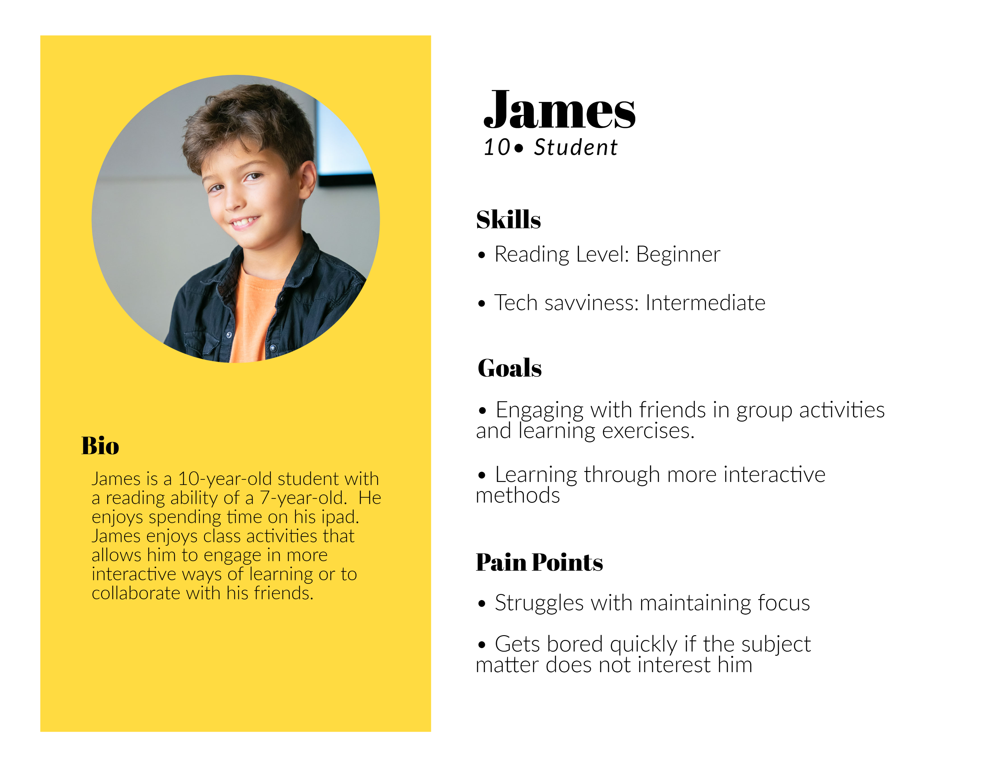

# Requirements Gathering

export const Highlight = ({children, color}) => (

{children}

);

Our team conducted two phases of requirements gathering. Initially, we posed our inquiries via email to both Scotstoun Primary and Fossil Grove. This was followed by an on-site visit to Fossil Grove for further investigation.

## Email

We initiated the conversation by sending an email to gain a comprehensive understanding of the project needs and align our team's conceptual framework with the client's expectations.

### Goals

- Gain knowledge about any <Highlight color="
#11a281"> previous student-engagement initiatives</Highlight> at Fossil Grove.
- Identify <Highlight color="#11a281"> potential challenges</Highlight> faced when engaging students at Fossil Grove.
- Comprehend the <Highlight color="#11a281"> anticipated learning outcomes</Highlight> for primary school students.
- Determine <Highlight color="#11a281"> available tools and technologies</Highlight> for implementation.

### Findings

- Previously conducted a session for a small group of primary school students, finding that engaging a larger group for two hours may pose a challenge.
- Field excursions for first-year earth science students from Glasgow University were organized using a <Highlight color="#11a281">three-station model with a teacher at each station</Highlight>, rotating students every 30 minutes followed by a group review.
- In addition to geology, aims to <Highlight color="#11a281">highlight connections to Glasgow's industrial heritage, climate change, evolution, and heritage conservation</Highlight>.
- Classes expected to be <Highlight color="#11a281">sizes of 29-33</Highlight>, suggesting that smaller groups of about 5-6 students would be manageable.
- Primary school students exhibit <Highlight color="#11a281">varying ability levels</Highlight>, with reading age ranging from 6-7 to 11-12.
- <Highlight color="#11a281">iPads</Highlight> are available for use, but usage is limited by restrictions on accessible content.

## On-Site Visit: Fossil Grove

We visited Fossil Grove to engage in-person discussions with the clients and participate in a guided tour of Fossil Grove.

### Goals

- Identify <Highlight color="#11a281"> suitable venues</Highlight> for planned activities.
- Understand the <Highlight color="#11a281"> educational significance</Highlight> of the locations.
- Discover any <Highlight color="#11a281"> limitations</Highlight> at the site.

### Findings

- Identified <Highlight color="#11a281">four primary areas of interest for visits</Highlight>: the main museum, the back of the museum, front region, and quarry.
- Pinpointed essential educational material in each area to enhance activity development.
- One teacher would be assigned to each student group of 6-7.
- Every student would have access to an <Highlight color="#11a281">iPad</Highlight>.
- <Highlight color="#11a281">WiFi connectivity is unavailable</Highlight> at the venue.
- Students are expected to <Highlight color="#11a281">explore independently</Highlight> as there are no guided tours.

## User Persona
Based on our findings, the team created a user persona to better empathize with and prioritize goals according to their needs.

## Product Vision

- Provide various <Highlight color="#11a281">engaging and easy-to-understand activities</Highlight>.
- Students should understand its pre-dinosaur period (emphasis on <Highlight color="#11a281"> timeline</Highlight>).
- Ensure the Fossil Grove's <Highlight color="#11a281"> geological significance</Highlight> is effectively communicated and appreciated.
- Encourage students to <Highlight color="#11a281">engage actively</Highlight> with the exhibits and information, minimizing distractions and maximizing attention spans.
