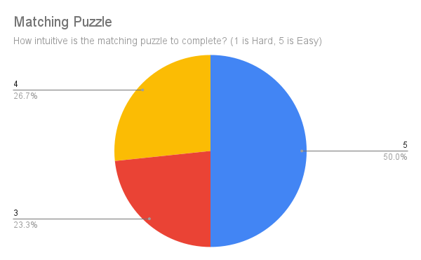

# Usability Tests

export const Highlight = ({children, color}) => (

{children}

);

The group assembled 30 students, all around 22 years old, to test Grove Quest. They were tasked with engaging in different mini-games provided, with the objective of <Highlight color="#11a281">evaluating their understanding</Highlight> of each game and to determine their <Highlight color="#11a281">satisfaction</Highlight> with Grove Quest.

It would be more beneficial if we could recruit students from the targeted user age group for a more precise evaluation and insights. Nonetheless, the outcomes of these trials still provided valuable information.

## Trivia Results

With 20% of responses at '3' (slightly effective), 33.3% at '4' (effective), and 46.7% at '5' (very effective), the Trivia questions in the game are shown to be effective in encouraging learning, with a majority leaning towards higher effectiveness.

## Image Chase Results

The Image Chase activity received 36.7% '3' ratings (slightly effective), 36.7% '4' ratings (effective), and 26.7% '5' ratings (very effective). These results indicate that Image Chase is effective in fostering interactive learning within Fossil Grove, with a balanced distribution across effectiveness levels.

## Match Mystery Results

With 33.3% rating it '3' (middle ground), 23.3% '4' (slightly easy), and 43.3% '5' (easy), the jigsaw puzzle is perceived as very intuitive, allowing kids to complete it with ease.

The sliding puzzle received 36.7% '3' ratings (middle ground), 20% '4' ratings (slightly easy), and 43.3% '5' ratings (easy). These results suggest that the sliding puzzle is also very intuitive, facilitating easy completion by children.

With 23.3% rating it '3' (middle ground), 26.7% '4' (slightly easy), and 50% '5' (easy), the matching puzzle stands out as highly intuitive, enabling kids to easily complete it.

## Grove Quest

Rated '3' (slightly effective) by 6.7%, '4' (effective) by 56.7%, and '5' (very effective) by 36.7%, Grove Quest as a whole is found to be effective in encouraging interactive learning at Fossil Grove, with a strong emphasis on higher effectiveness.

## Conclusion

The survey results affirm that the activities are generally well-designed to promote learning and are suitable for the intended audience, likely children. The <Highlight color="#11a281">balance between challenge and intuitiveness</Highlight> appears to be well-maintained across the activities, fostering an environment that is both <Highlight color="#11a281">engaging and educational</Highlight>. The insights gained from this survey could guide further refinement and development, ensuring that the activities continue to resonate with learners and educators alike.
